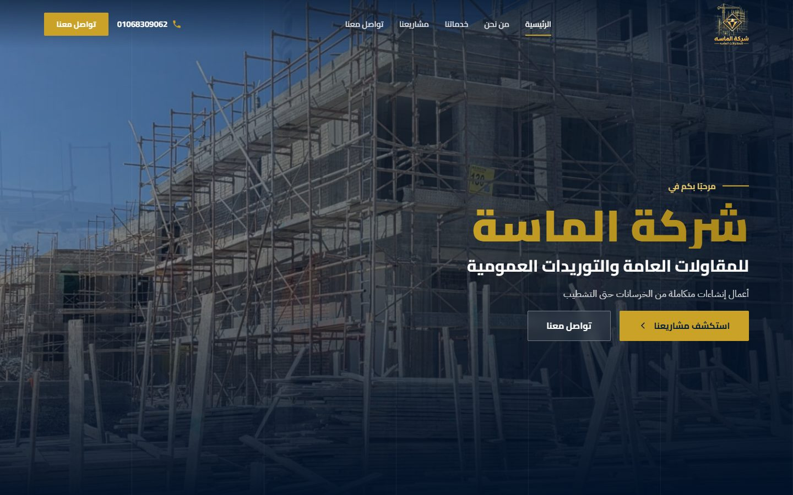
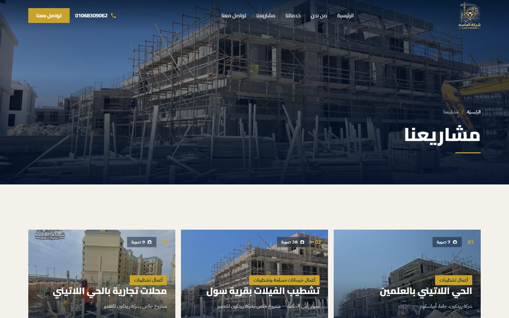
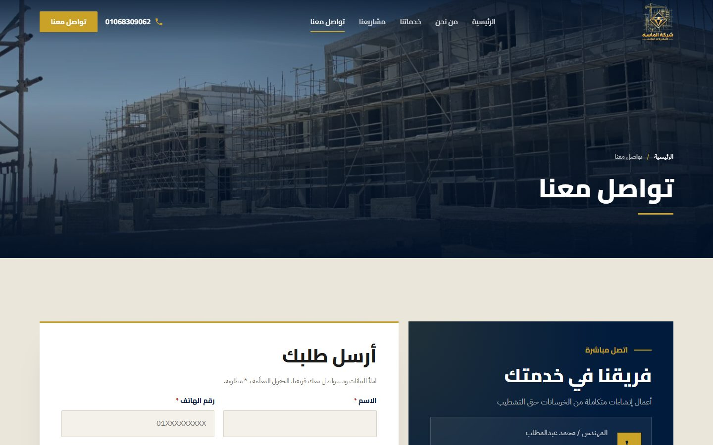
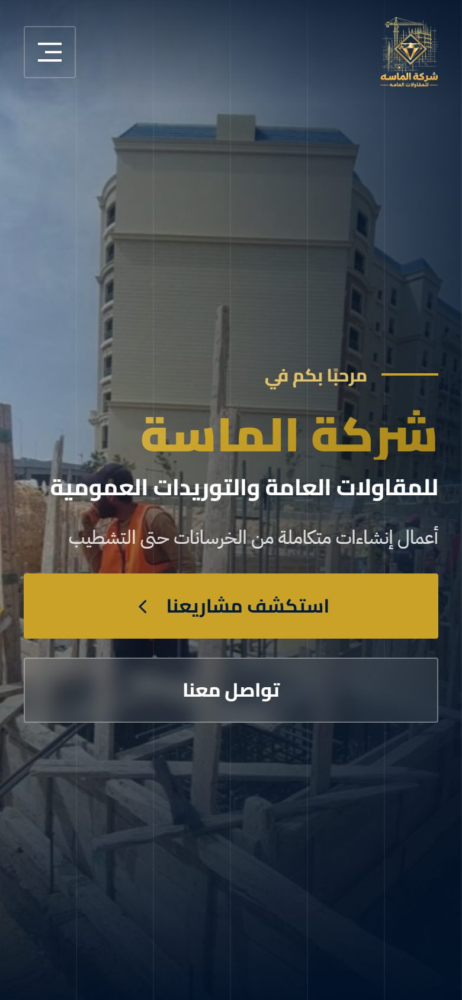
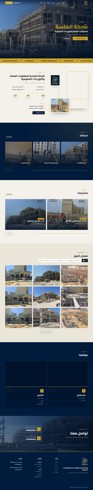

# Almasa — WordPress Theme

Custom RTL-first WordPress theme for **شركة الماسة للمقاولات العامة والتوريدات العمومية**
(Almasa General Contracting & General Supplies) — a construction company working from concrete to finishing.

Built on **Elementor Free** + **ACF Free**: every page section is an Elementor widget, while structured data
(projects, services, locations, engineers' phones) lives in custom post types.

<p align="center">
  
</p>

<div dir="rtl">

**بالعربي:** ثيم ووردبريس مخصص لشركة الماسة للمقاولات، عربي من اليمين للشمال من الأساس. كل سكشن في الموقع ويدجت في الإليمنتور (المجانية) تقدر تعدّل نصوصه وصوره وألوانه من غير كود، والبيانات الثابتة زي المشاريع والخدمات والمواقع وأرقام المهندسين بتتعدّل من لوحة التحكم.

</div>

---

## Screenshots

| Desktop — projects | Desktop — contact | Mobile |
| --- | --- | --- |
|  |  |  |

<details>
<summary>Full homepage</summary>
<p align="center"></p>
</details>

---

## Features

- **RTL Arabic first** — `dir="rtl"` from the WordPress locale, not a flipped LTR layout. Strings use the `almasa` text domain, ready for translation.
- **One Elementor widget per section** (category «الماسة»): hero, page hero, services marquee, intro, services, projects, gallery, locations, contact CTA, contact form, vision & mission, why choose us, header, footer.
- **One markup source** — each widget renders the theme's own template part (`template-parts/sections/*`), so pages still render from PHP when Elementor is off.
- **Fields prefilled with live data** — widget controls open with the real site values (site name, page titles, featured images, page links) instead of empty fields.
- **Header & footer as Elementor templates** without Pro — pick them in *Customizer → الهيدر والفوتر*; the PHP header/footer are the fallback.
- **Project gallery with tabs** — each tab in the gallery widget becomes a filter button with its own images; defaults to one tab per project. Lightbox included.
- **Contact form inbox** — submissions are saved as «الطلبات» in the dashboard (with an unread counter) and emailed to the admin. Nonce, honeypot and per-IP throttle; works without JavaScript.
- **Sliders** built on native CSS scroll-snap: looping arrows, progress bar, autoplay that pauses on hover, focus, touch or hidden tab.
- **Motion** limited to `transform` / `opacity`, and disabled under `prefers-reduced-motion`.
- **No hardcoded content** — logo, menus, phones, locations, images and copy all come from WordPress, never from PHP/CSS/JS.

## Requirements

| | Version |
| --- | --- |
| WordPress | 6.4+ |
| PHP | 8.1+ |
| [Elementor](https://wordpress.org/plugins/elementor/) (Free) | required for visual editing |
| [Advanced Custom Fields](https://wordpress.org/plugins/advanced-custom-fields/) (Free) | required for project / location / phone fields |

Developed and tested locally on WordPress 7.1, PHP 8.3 and Elementor 4.3 (Arabic locale).

## Installation

1. Copy `wp-content/themes/almasa/` into your site's `wp-content/themes/` (or zip that folder and upload it from *Appearance → Themes*).
2. Install and activate **Elementor** and **Advanced Custom Fields**.
3. Activate the **Almasa** theme and set the site language to Arabic.
4. Add content from the dashboard (see below), then build pages in Elementor using the «الماسة» widgets.

> This repository contains the theme only. WordPress core, plugins, the uploads folder and the database (pages, Elementor layouts, media) are not included.

## Where content is edited

| Content | Dashboard location |
| --- | --- |
| Projects (title, work type, company, gallery, featured, order) | **المشاريع** |
| Services | **الخدمات** |
| Locations (address, optional map query) | **المواقع** |
| Engineers' names & phones | **جهات الاتصال** |
| "Why choose us" items | **لماذا تختارنا** |
| Vision & mission | Fields on the «من نحن» page |
| Contact form submissions | **الطلبات** |
| Hero slideshow images | Media library → «عرض في الهيرو» |
| Logo, site name, tagline | Customizer → Site Identity |
| Social links | Customizer → **السوشيال ميديا** |
| Header / footer template | Customizer → **الهيدر والفوتر** |
| Menus | Appearance → Menus |

## Theme structure

```text
wp-content/themes/almasa/
├── style.css · functions.php · theme.json · screenshot.png
├── front-page.php · page.php · single-project.php · archive-project.php · …
├── inc/
│   ├── elementor/          # Almasa_Widget base + section & layout widgets
│   ├── post-types.php      # project, service, location, contact, reason
│   ├── acf.php             # local ACF field groups (acf-json/ for sync)
│   ├── project-gallery.php # native gallery metabox for projects
│   ├── contact-form.php    # form handler + «الطلبات» inbox
│   ├── social.php · media.php · helpers.php · enqueue.php · security.php
│   └── seed-once.php       # one-time WP-CLI content seed (dev only)
├── template-parts/
│   ├── sections/           # hero, intro, services, projects, gallery, …
│   ├── projects/           # card, single, archive
│   └── header/ · footer/
└── assets/
    ├── css/                # tokens.css, base.css, site.css, motion.css
    └── js/theme.js         # sliders, reveal, gallery filter, lightbox, form
```

## Design tokens

| Token | Value | Use |
| --- | --- | --- |
| `--almasa-navy` | `#011B3D` | Brand color — header, footer, dark surfaces |
| `--almasa-gold` | `#C9A227` | Primary accent, buttons |
| `--almasa-paper` | `#F4F1EA` | Light surfaces |
| `--almasa-text` | `#1C1C1C` | Body text |

Fonts: **Cairo** (headings) and **IBM Plex Sans Arabic** (body). Container width 1280px; near-square corners.
The same colors and fonts are mirrored in Elementor's global Site Settings.

## Development notes

- Function prefix `almasa_`, text domain `almasa`; all output is escaped.
- `PROJECT_RULES.md` is the full specification (architecture, data model, widget rules). A copy ships inside the theme.
- Single project pages and the project archive are PHP templates, since Elementor's Theme Builder requires Pro.

## License

[GPL v2 or later](https://www.gnu.org/licenses/gpl-2.0.html).

Theme by [MohamedAmjad](https://mohamed-amjad.com).
